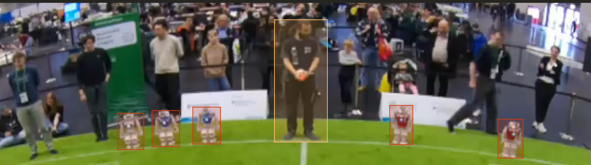
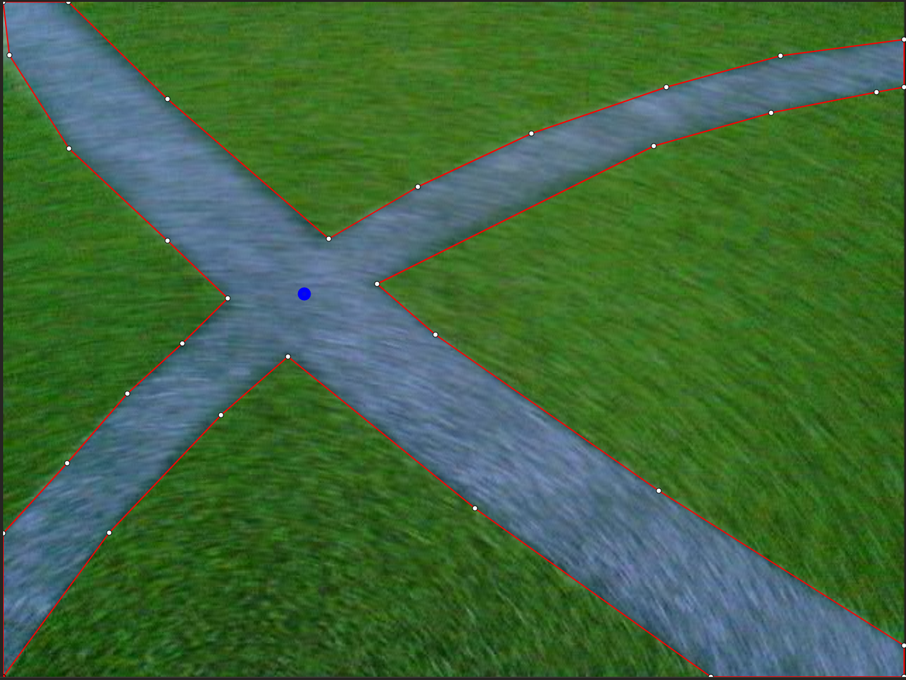

# Annotations

Our images recorded by the robots are annotated with bounding boxes, polygon masks and keypoints. Currently we use bounding boxes for robots and the ball. Polygon masks for lines, own robot contour and goal posts. Keypoints are used for center point of ball, line intersections and the base of goal posts.

## Referee Annotations
<figure markdown="span">
  
  <figcaption>Don't annotate the referee as referee class if they don't wear the referee shirt</figcaption>
</figure>
All people standing in on the field should be annotated as person class or referee if they wear the shirt.

## Ball Annotations

## Robot Annotations

## Line Annotations
<figure markdown="span">
  
  <figcaption>The line intersection is marked with the `Circle Cross` keypoint</figcaption>
</figure>