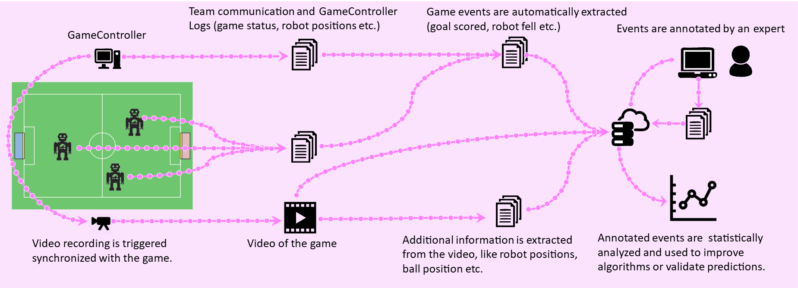

# Visual Analytics Tool

Visual Analytics Toolbox is an interactive tool for viewing, annotating, and debugging robot soccer matches. Inspired by advanced sports analysis platforms, it goes beyond simple video review by integrating synchronized log data from each robot.

