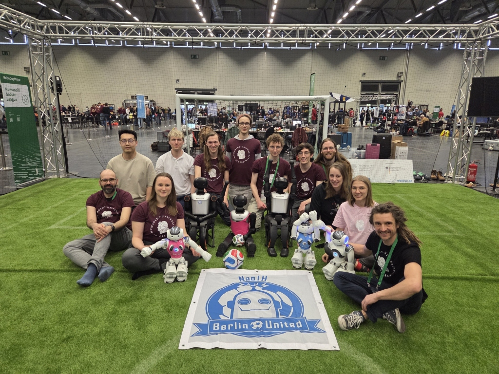

# Welcome to Berlin United 2025

## About us
[Berlin United](https://berlin-united.org/) is a robot soccer team in the [RoboCup](https://robocup.org/) [Standard Platform League](https://spl.robocup.org/). 
We release most of our code on GitHub. 

The research group **Berlin United** is part of the research lab for Adaptive Systems at Humboldt-Universität zu 
Berlin headed by Prof. Verena Hafner. At the current state the core team consists of about 12 students of Bachelor, 
Master/Diploma, and PhD levels.  Besides the direct participation at the RoboCup competitions NaoTH is involved in 
teaching at the university, public engagement and building of the RoboCup community.

**NaoTH** was founded at the end of 2007 at the AI research lab headed by Prof. Hans-Dieter Burkhard. As a direct 
successor of the **Aibo Team Humboldt** which was active in the Four Legged League of the RoboCup as a part of 
the **GermanTeam** until 2008. GermanTeam won the world championship three times during its existence. 

**NaoTH** participated yearly at the RoboCup competitions since the first SPL competition in 2008 in Suzhou.
The most recent achievements include 3rd place in the Outdoor Competition at the RoboCup world championship in 2016 
and 2nd place in the Mixed Team Competition as part of the team **DoBerMan** at the RoboCup 2017. 
%For the full list of achievements please refer to the web page <http://naoth.de>.

In 2010 and 2011 we also competed in the 3D Simulation league with the same code as used for the SPL. In the 3D 
Simulation, we won the German Open and the AutCup competitions and achieved the 2nd place at the  RoboCup World 
Championship 2010 in Singapore.

In 2011 we formed a conjoint team *Berlin United* with the team FUmanoids from Berlin, which participated in the KidSize League. 
The collaboration included extensive exchange of experience, sharing of code and organization of joint workshops.
In 2017 the team FUmanoids ceased to exist. Since then *NaoTH* remains the only member of Berlin United and continues to 
compete under this name.

In 2017 and 2018 **NaoTH** competed together with the team NaoDevils as joint team **DoBerMan** at the RoboCup SPL Mixed Team
Competition and achieved 2nd place in both years. In 2017 **NaoTH** won the 2nd place in the challenger shield and in 2018  
reached the quarterfinals in the champions cup of the main competition.

In 2019 we won the SPL Technical Challenge and together with B-Human we won the Mixed Team Competition.

## Team

The research group **NaoTH** is part of the research lab for Adaptive
Systems at Humboldt-Universität zu Berlin headed by Prof. Verena Hafner.
At the current state the core team consists of about 12 students of
Bachelor, Master/Diploma, and PhD levels. Besides the direct
participation at the RoboCup competitions NaoTH is involved in teaching
at the university, public engagement and building of the RoboCup
community.

**NaoTH** was founded at the end of 2007 at the AI research lab headed by
Prof. Hans-Dieter Burkhard. As a direct successor of the **Aibo Team
Humboldt** which was active in the Four Legged League of the RoboCup as a
part of the **GermanTeam** until 2008. GermanTeam won the world
championship three times during its existence.

**NaoTH** participated yearly at the RoboCup competitions since the first
SPL competition in 2008 in Suzhou. The most recent achievements include
3rd place in the Outdoor Competition at the RoboCup world championship
in 2016 and 2nd place in the Mixed Team Competition as part of the team
**DoBerMan** at the RoboCup 2017.

In 2010 and 2011 we also competed in the 3D Simulation league with the
same code as used for the SPL. In the 3D Simulation, we won the German
Open and the AutCup competitions and achieved the 2nd place at the
RoboCup World Championship 2010 in Singapore.

In 2011 we formed a conjoint team **Berlin United** with the team
**FUmanoids** from Berlin, which participated in the KidSize League. The
collaboration included extensive exchange of experience, sharing of code
and organization of joint workshops. In 2017 the team **FUmanoids** ceased
to exist. Since then **NaoTH** remains the only member of Berlin United
and continues to compete under this name.

In 2017 and 2018 **NaoTH** competed together with the team NaoDevils as
joint team **DoBerMan** at the RoboCup SPL Mixed Team Competition and
achieved 2nd place in both years. In 2017 *NaoTH* won the 2nd place in
the challenger shield and in 2018 reached the quarterfinals in the
champions cup of the main competition.

# Citing this Documentation
TODO